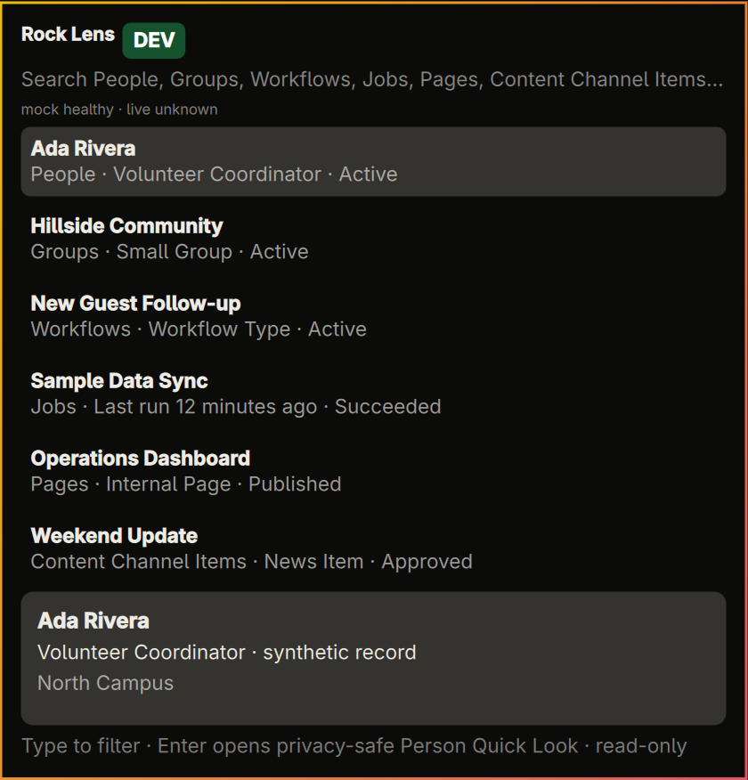

# Rock Lens

Rock Lens is a read-only Omarchy 4.0.2+ launcher for Rock RMS discovery. Normal
use is locked to production and uses the `.ROCK` session created by Magnus to
search six fixed Rock REST v1 resources and load the current person's Personal
Links. Group results include their Rock Group Type. The six category reads run
concurrently, and a brief memory-only Magnus session cache keeps successive
searches responsive without persisting the cookie. A compact Settings view
supports multiple Rock instances or accounts, connection testing, sign-out,
profile removal, per-profile Recent Links, category controls, person-context
visibility, and close-after-open behavior. QML is only a view: search
terms and opaque navigation IDs travel over an owner-only local Unix socket,
while credentials, cookies, raw record IDs, URLs, and response bodies remain
inside the Python broker.

For privileged Rock file inspection, Rock Lens also includes a hardened,
read-only Magnus adapter. Setup first records the selected Rock instance's
strict HTTPS origin, keeps that origin's credentials in Secret Service, and
gives each command an ephemeral Magnus profile that is deleted immediately
afterward.

Rock Lens also emulates Rock's Quick Return behavior as **Recent Links**. It
remembers only same-origin records or Personal Links that were opened from the
launcher, deduplicates them, caps the list at 20, and stores private target data
in an owner-only local file. It does not read or follow browser history.



## Run the MVP

```bash
python3 -m unittest discover -s tests -v
python3 -m rock_lens_broker --socket /tmp/rock-lens-demo.sock
```

The installed Omarchy integration uses `$XDG_RUNTIME_DIR/rock-lens/broker.sock`
and starts the broker without passing queries or credentials as arguments.
Summon it with `Super+R` or click the Rock bar indicator.

## Developer mode

Synthetic preview data remains available for UI development and privacy-safe
testing, but it is not exposed during normal use. The broker accepts DEV only
when its process starts with this exact flag:

```bash
ROCK_LENS_DEVELOPER_MODE=1 python3 -m rock_lens_broker
```

The installed shell must receive the same environment flag before it starts.
When enabled, the DEV/PROD badge and switch reappear. Without the flag, startup
forces PROD, rewrites a previously saved DEV context to PROD, hides the switch,
and rejects direct socket requests to enter DEV. Values such as `true` or `yes`
do not enable it.

## Optional OpenID Connect client

In Rock, create a dedicated client under `Admin Tools > Settings > OpenID
Connect Clients`. Register this exact loopback redirect URI:

```text
http://127.0.0.1:41397/oauth/callback
```

Allow the minimum scopes Rock Lens requests: `openid` and `offline_access`.
Rock's current source supports a public client with no secret and requires S256
PKCE for that client type. For an installed version or confidential client that
requires a secret, generate one; Rock Lens stores it in Secret Service, never
in the repository or command line.

These settings follow Rock's official [OpenID Connect
documentation](https://community.rockrms.com/documentation/BookContent/9#openid-connect)
and the [current Rock authorization-provider
source](https://github.com/SparkDevNetwork/Rock/blob/f0917ef9799aa433d8be7b648666ecd5239550b1/Rock.Oidc/Authorization/AuthorizationProvider.cs).

Run the owner-local interactive setup for production:

```bash
python3 -m rock_lens_broker configure
```

Developer-mode OAuth metadata can still be configured with
`ROCK_LENS_DEVELOPER_MODE=1` and `--context DEV`.

Enter Rock's Public Application Root as the issuer, copy the client ID, accept
the loopback URI, and leave the secret blank for a public client. The broker
includes this standards-based end-user login boundary, but the current live
search and Personal Links path does not use it. Those reads use the ephemeral
local Magnus session described below. The OpenID client remains available for
future user-facing capabilities that should not use an admin cookie.

The client metadata file is owner-only at
`$XDG_CONFIG_HOME/rock-lens/oidc.json` (normally
`~/.config/rock-lens/oidc.json`). Client secrets and tokens are stored by the
desktop Secret Service. The launcher receives only `configured`, state, and a
fixed display label.

Rock profile names, strict origins, the active profile ID, and allowlisted
preferences are non-secret metadata stored owner-only at
`$XDG_CONFIG_HOME/rock-lens/profiles.json`. Usernames and passwords are never
stored there; Secret Service keys use stable random profile IDs, so two accounts
on the same Rock instance remain separate. Existing single-instance setup and
Recent Links migrate automatically, with the old history retained as rollback.

## Configure Magnus

Magnus is deliberately separate from end-user OpenID Connect login. Open
**Settings** (or press `Ctrl+,`) and enter Rock credentials in the masked form.
The broker sends them only over
its owner-only socket and stores them in Secret Service. The equivalent terminal
setup remains available:

```bash
python3 -m rock_lens_broker magnus configure
python3 -m rock_lens_broker magnus status
```

The same ephemeral session can then perform the fixed, bounded search and
Personal Links reads. Its temporary profile is removed immediately; only the
validated cookie is retained in broker memory with a 15-minute idle timeout.
The adapter still exposes only bounded `ls`, `cat`, and
`hash` file operations; it does not expose a generic REST client. See
[docs/MAGNUS.md](docs/MAGNUS.md) for its exact restrictions.

**Sign out** clears the selected profile's password, username, and in-memory
cookie while keeping its profile metadata and local Recent Links. **Remove**
also deletes that profile's local metadata and Recent Links. Both actions
require a second click in the launcher and never modify the Rock server.

In the launcher, an empty **Search** view shows local **Recent Links**, with a
confirmed **Clear** action in the section header. Typing immediately replaces
them with search results. **Personal Links** has its own tab and is fetched only
when that tab is opened, so its Rock network read cannot delay Search or Recent
Links. **Open** is offered for every search category:
People, Groups, Workflow Types, Scheduled Jobs, Pages, and Content Channel
Items. Each target uses a fixed Rock route and must resolve to the exact
configured Rock origin; Personal Links have the same origin restriction.

Start a query with an entity prefix to search only that Rock category. A bare
prefix such as `g:` lists the first three items in that category.

| Category | Short prefix | Full aliases | Shortcut |
|---|---|---|---|
| People | `p:` | `person:`, `people:` | `Alt+P` |
| Groups | `g:` | `group:`, `groups:` | `Alt+G` |
| Workflow Types | `w:` or `wt:` | `workflow:`, `workflowtype:`, `workflowtypes:` | `Alt+W` |
| Jobs | `j:` | `job:`, `jobs:` | `Alt+J` |
| Pages | `pg:` | `page:`, `pages:` | `Alt+Shift+P` |
| Content Channel Items | `c:` | `content:`, `item:`, `items:` | `Alt+C` |

For example, `g: youth` calls only the Groups endpoint. The active scope appears
as a badge beside the search field. `Esc` clears the scope before closing the
panel, and `Alt+0` clears it directly. Unknown prefixes remain ordinary search
text; no slash-command mode is required.

The search field keeps native editing behavior. Up and Down move through Recent
Links or results and across the Search/Personal Links boundary. Tab cycles the
search input, its displayed items, and Personal Links (Shift+Tab reverses), and
Enter or Space opens the selected live target. Backspace on a highlighted item
returns to the search field and deletes at the search cursor, so narrowing can
continue without an extra navigation step.

People results include compact duplicate-name context when Rock provides it:
age, conservatively identified spouse, family campus, and connection status.
Spouse is shown only for a married person with exactly one other active Adult
in the family group. Email, phone, address, and full birth date are not fetched.
Gated DEV never opens a target and does not display the PROD Recent Link
history.

## Safety guarantees

- Normal use is locked to PROD. DEV requires the exact process-level developer
  flag and remains visibly labeled while enabled.
- Rock login uses authorization code flow, S256 PKCE, exact callback state
  validation, HTTPS discovery, and same-origin authorization/token endpoints.
- Client secrets and access/refresh tokens use Secret Service and never enter
  QML, argv, repository files, logs, notifications, or screenshots.
- Disconnect removes the context's local token set; it does not claim to end
  the user's browser-wide Rock session.
- PROD never falls back to synthetic results. Without configured Magnus
  credentials or with a failed endpoint, the affected live category is empty.
- Live reads are fixed REST v1 GET operations with bounded responses and field-level
  output allowlists. QML cannot supply a URL, API path, OData field, or filter
  expression.
- Personal Links are read-only, restricted to same-origin HTTPS targets, and
  represented outside the broker by opaque IDs.
- Recent Links (the local Quick Return store) contain only launcher-opened
  targets, are capped at 20, are visible only in PROD, and are stored under
  `$XDG_STATE_HOME/rock-lens` with owner-only permissions.
- There is no mutation transport, SQL execution, job trigger, or Run Now UI.
- Magnus accepts only the configured HTTPS Rock origin, rejects cross-origin
  and traversal paths, uses per-origin Secret Service records, and exposes no
  mutation operation.
- Broker errors are reduced to stable public codes. Response bodies, tokens,
  cookies, SQL, unselected PII, URLs, and exceptions are not logged or
  forwarded to QML.

See [docs/ARCHITECTURE.md](docs/ARCHITECTURE.md) and
[docs/VERIFICATION.md](docs/VERIFICATION.md).
