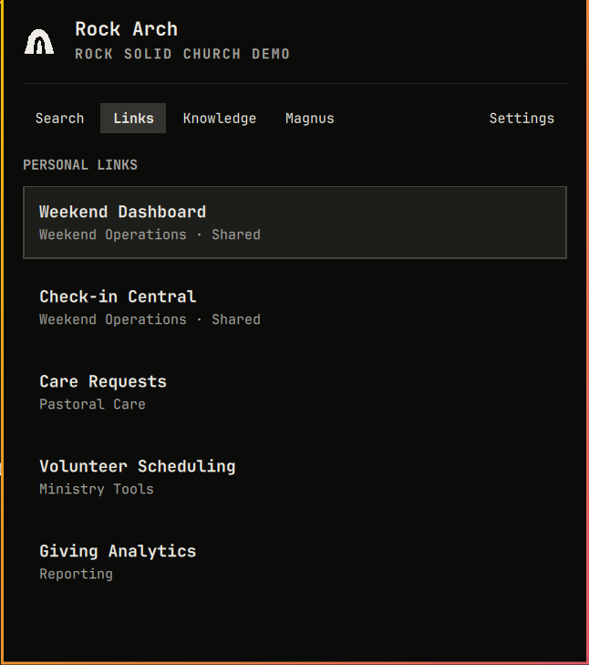
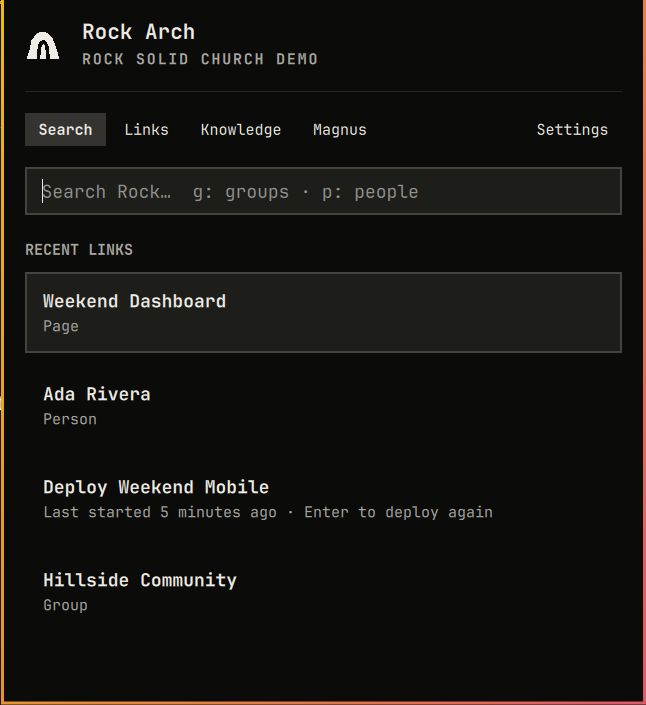
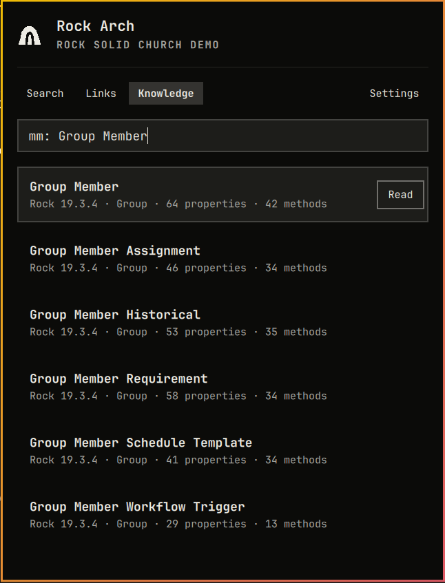
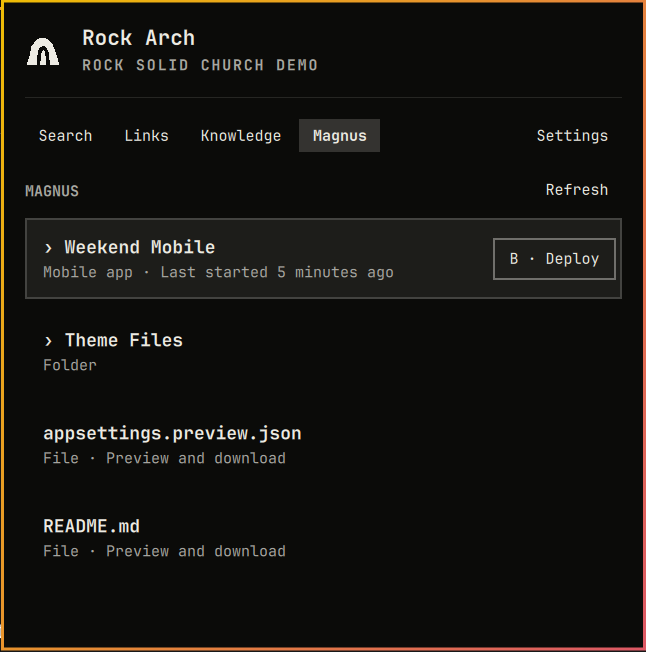
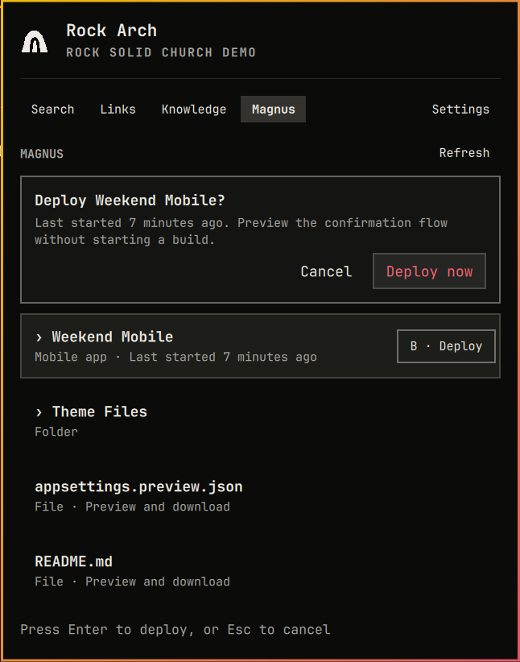

# Rock Arch — Bridging Rock RMS and Omarchy

Rock Arch is a keyboard-first Rock RMS launcher for Omarchy. It brings Rock
search, Personal Links, Recent Links, public Rock Knowledge, optional Magnus
tools, profiles, and updates into one native panel—and exposes the same bounded
capabilities through an agent-friendly terminal command.

Every user signs directly into their own Rock instance. Rock Arch uses the
native Rock session and fixed REST v1 routes; it does not require an OpenID
client, OAuth application, Rock MCP server, Magnus CLI, Node.js, or npm.


_Live search captured against the public Rock Solid Church Demo. Person context
and related Group matches make duplicate names easier to distinguish._

## Install

Rock Arch supports Omarchy 4.0.2 or newer:

```bash
omarchy plugin add https://github.com/ONE-ALL-Church/rock-arch-omarchy.git --enable
```

Open Rock Arch with `Super+R` or its rock-arch menu-bar icon. On first launch,
enter:

1. A recognizable profile name, such as `Rock Solid Church Production`
2. The Rock domain, such as `rock.example.org`
3. The user's Rock username
4. The user's Rock password

Select **Connect**. Rock Arch verifies the login before storing the username and
password in desktop Secret Service. The returned `.ROCK` cookie remains only in
broker memory and expires after 15 idle minutes. Saved credentials let Rock Arch
establish a fresh session on the next action without asking the user to sign in
again.

The one-time **Finish setup** screen detects which supported Rock entities the
account can search. It offers only accessible categories and asks whether Rock
Arch should install its own updates automatically. Accessible categories start
enabled; automatic updates start disabled. Both choices remain editable in
Settings.

## Search Rock

Search covers eight fixed Rock entity categories:

- People
- Groups
- Group Types
- Workflow Types
- Scheduled Jobs
- Pages
- Content Channel Types
- Content Channel Items

The account's Rock permissions remain authoritative. After login, Rock Arch
probes each supported category and hides any category that is unavailable or
unauthorized. Search never falls back to sample data during normal use.

An unscoped query searches every enabled category plus matching Personal Links.
A numeric ID or GUID is checked across all enabled categories, so `42` can
return several entity types whose IDs overlap. Use a prefix when the type is
known:

| Category | Prefixes | Keyboard shortcut |
|---|---|---|
| People | `p:`, `person:`, `people:` | `Alt+P` |
| Groups | `g:`, `group:`, `groups:` | `Alt+G` |
| Group Types | `gt:`, `grouptype:`, `grouptypes:` | `Alt+Shift+G` |
| Workflow Types | `w:`, `wt:`, `workflow:`, `workflowtype:` | `Alt+W` |
| Jobs | `j:`, `job:`, `jobs:` | `Alt+J` |
| Pages | `pg:`, `page:`, `pages:` | `Alt+Shift+P` |
| Content Channel Types | `ct:`, `contenttype:`, `channeltype:` | `Alt+Shift+C` |
| Content Channel Items | `c:`, `content:`, `item:` | `Alt+C` |

Examples:

```text
Decker
g: Decker
w: background check
42
p: a81b7c6d-1234-4abc-9876-0123456789ab
```

A bare prefix such as `g:` lists the first three accessible Groups. `Alt+0`
clears the active scope. People can include age, conservatively inferred spouse,
family campus, and connection status; Rock Arch does not fetch email, phone,
address, or full birth date for search context.

## Recent Links and Personal Links

An empty Search shows **Recent Links**, newest-used first. Opened records and
accepted Magnus builds become profile-scoped shortcuts, capped at 20. A build
shortcut returns to the confirmation flow—it never silently deploys. `X` or
`Delete` opens the clear confirmation.

**Personal Links** are the current user's Rock admin bookmarks. They remain a
separate workspace, while unscoped Search can also match their title or section.
Every target must resolve to the selected Rock instance.



_Deterministic preview content demonstrates a useful Personal Links collection;
the public demo account does not provide personal bookmarks._



_Preview Recent Links include a page, person, group, and Magnus build shortcut
without opening a browser or deploying anything._

## Search public Rock Knowledge

Open the dedicated **Knowledge** workspace or press `Alt+K`. A plain question
searches the public Rock Agent Knowledge Base. Prefixes narrow the search to a
structured area:

| Area | Prefixes | Example |
|---|---|---|
| Model Map | `mm:`, `model:` | `mm: Group Member` |
| Rock issues | `is:`, `issue:` | `is: check-in labels` |
| Rock ideas | `idea:` | `idea: event duration` |
| Lava contexts | `lava:`, `lc:` | `lava: workflow` |
| Recipes | `recipe:` | `recipe: volunteer onboarding` |
| Concept guides | `guide:`, `concept:` | `guide: groups` |

The quiet `kb:` and `knowledge:` shortcuts also work from main Search. They
transfer the rest of the query into Knowledge rather than mixing public results
into Rock entity results.



_Live public Knowledge results for `mm: Group Member`._


_A result opens as bounded text inside Rock Arch. Structured references become
selectable Related items, so a model, issue, Lava context, recipe, or guide can
lead to the records it cites._

Only the query is sent to the fixed, credentialless public Knowledge service.
Rock Arch does not send the selected Rock domain, profile, cookie, credentials,
Personal Links, Recent Links, or entity results. **Open source** validates and
opens the cited public HTTPS page as a separate action. Knowledge results are
cached briefly in memory and are not added to Recent Links.

Displayed material is attributed to the [Rock Agent Knowledge Base by ONE&ALL
Church](https://github.com/ONE-ALL-Church/rock-agent-kb).

## Optional Magnus tools

After normal Rock login, Rock Arch checks whether that account can access the
server-side Magnus API. If it can, the Magnus workspace appears automatically.
A missing plugin or denied probe does not affect Search, Links, or Knowledge.

Magnus supports:

- Navigating the server-provided folder tree
- Opening a bounded UTF-8 text preview
- Downloading an allowed file to a new owner-only local file
- Copying file content or a SHA-256 hash
- Opening descriptor-approved same-origin views
- Starting a descriptor-approved mobile-app build after confirmation
- Reviewing local build-acceptance receipts






_The public Demo Church does not have Magnus. These images use the gated,
side-effect-free preview workspace: its browse, file, and confirmation flows are
real UI, while its content is deterministic and no build or local action runs._

Deploy is the only Rock server mutation Rock Arch exposes. The build path must
be advertised by Magnus, contain a numeric mobile-app ID, and pass same-origin
validation. Every initial or repeated build requires confirmation. Magnus does
not expose a dependable completion endpoint, so Rock Arch reports the local
acceptance time and never invents a completion or “last deployed” state.

## Profiles, preferences, and updates

Open **Settings** with `Ctrl+,` or `Ctrl+4` to:

- Add, rename, switch, test, sign out of, or remove Rock profiles
- Hide the menu-bar icon while keeping `Super+R` available
- Show or hide person context
- Enable or disable Recent Links
- Choose whether the panel closes after opening an item (enabled by default)
- Enable or disable terminal and agent access (enabled by default)
- Enable only the accessible entity categories the user wants searched
- Check for, install, or automatically install Rock Arch updates

Signing out removes the profile's saved username and password and clears its
memory-only cookie while keeping local profile metadata. Removing a profile also
removes that metadata and its Recent Links. Both actions require confirmation
and do not modify the Rock server.

Git-managed installations check the public remote once a day. Automatic update
installation is opt-in. Rock Arch refuses to install over local tracked changes
or diverged history, validates plugin identity and version, and delegates the
actual fast-forward update, validation, rollback, and shell restart to Omarchy.

Manual update:

```bash
omarchy plugin update oneall.rock-arch
```

## Keyboard map

| Surface | Move | Activate | Return or cancel | Direct actions |
|---|---|---|---|---|
| Workspaces | Tab / Shift+Tab | — | `Esc` closes | `Ctrl+1` Search, `Ctrl+2` Links, `Alt+K` Knowledge, `Ctrl+3` Magnus, `Ctrl+4` Settings |
| Search / Recent | Up / Down | Enter or Space | Backspace resumes editing | `X` or Delete clears recents |
| Knowledge results | Up / Down | Enter | Backspace edits search | `Alt+K` opens Knowledge |
| Knowledge detail | Tab / Shift+Tab | Enter or Space | Esc walks Back history | Open source and Related items |
| Personal Links | Up / Down | Enter or Space | Backspace returns to Search | — |
| Magnus folders | Up / Down | Enter or Space | Backspace or Esc | `R` refresh, `B` deploy selected app |
| Magnus preview | Tab / Shift+Tab | Enter or Space | Esc | `D` download, `C` copy, `H` hash, `O` open, `R` refresh |
| Confirmations | Tab / Shift+Tab | Enter or Space | Esc | — |
| Onboarding / Settings | Tab / Shift+Tab | Enter or Space | Esc | — |

The first Recent Link is selected when Search opens; the first matching result
is selected when a query completes. Selection uses the same visible treatment
in every list. Backspace from a selected item returns to the search field and
deletes at the cursor, allowing immediate refinement.

## Terminal and agent CLI

A managed install creates an owner-local `rock-arch` command. It is a JSON
client of the same broker—not another login, HTTP stack, or credential store.
The command can start the broker while the panel is closed and honors the same
active profile, permissions, enabled categories, allowlists, and confirmations.

```bash
rock-arch status
rock-arch doctor --refresh
rock-arch capabilities --refresh
rock-arch login
rock-arch search --stdin
rock-arch search 42 --entity groups
rock-arch knowledge search "mm: Group Member"
rock-arch links personal
rock-arch links recent
rock-arch magnus status
rock-arch magnus browse
rock-arch updates status
```

Use `rock-arch search --stdin` for private terms so the query does not enter
shell history or process arguments. Login reads the password from a masked
prompt; there is no password argument. Results return process-local opaque
`safeId` values. Inspect one with `rock-arch describe SAFE_ID`, then use it in a
follow-up action.

Opening, copying, downloading, clearing history, signing out, removing a
profile, installing an update, and starting a build require `--confirm`.
`--dry-run` validates the target and describes expected effects without running
the action. There is no arbitrary endpoint, raw HTTP, SQL, generic mutation,
job-run, Magnus upload, or Magnus delete command.

See [docs/CLI.md](docs/CLI.md) for the full command and JSON contract.

## Security and privacy model

- Rock login is a redirect-free HTTPS `POST /api/Auth/Login` to the selected,
  strictly validated origin.
- Only a bounded `.ROCK` cookie is accepted. It remains in memory and expires
  after 15 idle minutes.
- Usernames and passwords live in desktop Secret Service under a random profile
  ID; they are never returned to QML or placed in process arguments.
- Entity search uses eight fixed REST v1 routes with fixed projections and
  bounded responses. There is no REST v2 or arbitrary endpoint transport.
- Cookies are attached only to exact-origin HTTPS requests. Cross-origin
  redirects and malformed targets are rejected.
- QML receives display fields and process-local opaque IDs, not raw Rock IDs,
  cookies, credentials, or unrestricted URLs.
- Public Knowledge is a separate credentialless client with a fixed public
  origin and bounded schemas.
- The broker socket and local state are owner-only. The current Unix account is
  the terminal client's OS trust boundary.
- Production never falls back to preview data. Magnus builds require explicit
  confirmation and are the only supported server mutation.

The experimental OpenID implementation was removed in version 0.14. Rock Arch
does not read legacy OpenID metadata, client secrets, or tokens; user-owned old
records are left untouched instead of silently deleted.

See [docs/ARCHITECTURE.md](docs/ARCHITECTURE.md) and
[docs/VERIFICATION.md](docs/VERIFICATION.md) for the complete boundaries and
acceptance record.

## Developer preview

The preview workspace is intended for UI development, screenshots, and demos
without private Rock or Magnus data. It includes realistic content for every
search category, People context, Personal Links, Recent Links, all Knowledge
areas and related records, Magnus folders/files, build history, and build
confirmation.

Start a development broker with the exact process flag:

```bash
ROCK_ARCH_DEVELOPER_MODE=1 python3 -m rock_lens_broker
```

Only the literal value `1` enables preview context. The panel intentionally
does not show a DEV/PROD badge or end-user context switch. A developer client
may select the broker-owned DEV context through the local socket; normal startup
forces PROD and rejects that request. Preview open, download, clipboard,
source-open, clear-history, and build actions are safe no-ops with explicit
preview feedback. PROD never receives deterministic fallback content.

## Development

Run the local acceptance suite from the repository root:

```bash
python3 -m unittest discover -s tests -v
uvx --from ruff==0.16.5 ruff check rock_lens_broker tests
uvx --from ty==0.0.78 ty check rock_lens_broker
python3 -m compileall -q rock_lens_broker
omarchy plugin validate .
/usr/lib/qt6/bin/qmllint plugin/oneall.rock-arch/*.qml plugin/oneall.rock-arch/*.js
git diff --check
```

Additional references:

- [Design system](docs/DESIGN.md)
- [Keyboard and panel audit](docs/KEYBOARD-AUDIT.md)
- [Magnus behavior](docs/MAGNUS.md)
- [Release process](docs/RELEASING.md)
- [Changelog](CHANGELOG.md)

Rock Arch is licensed under the [MIT License](LICENSE).
