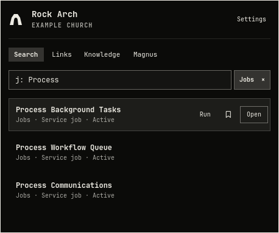
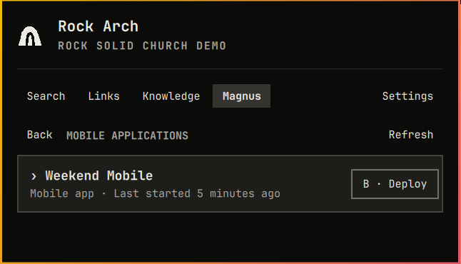

# Rock Arch — Bridging Rock RMS and Omarchy

Rock Arch is a keyboard-first Rock RMS launcher for Omarchy. It brings Rock
search, Personal Links, Recent Links, public Rock Knowledge, optional Magnus
tools, profiles, and updates into one native panel—and exposes the same bounded
capabilities through an agent-friendly terminal command.

Every user signs directly into their own Rock instance. Rock Arch uses the
native Rock session, fixed REST v1 routes, and narrowly scoped job block actions; it does not require an OpenID
client, OAuth application, Rock MCP server, Magnus CLI, Node.js, or npm.



_The 0.27.0 Search interface with synthetic jobs and account details, rendered
with Omarchy UI controls in an isolated preview window. No tenant data is shown._

## Install

Rock Arch supports Omarchy 4.0.2 or newer. Runtime requirements are:

- Omarchy's Quickshell desktop and Python 3.11 or newer (`python`).
- Hyprland (`hyprctl`) and `libxkbcommon` for optional shortcut setup and
  physical-key conflict checks; both are part of the Omarchy desktop.
- `secret-tool` (`libsecret`) and a running, unlocked Secret Service provider,
  normally `gnome-keyring`, for saved Rock logins.
- Git (`git`) for installation and updates, `xdg-open` (`xdg-utils`) for browser
  actions, `wl-copy` (`wl-clipboard`) for clipboard actions, and `notify-send`
  (`libnotify`) for build/update notifications.

These are standard Omarchy desktop packages. Rock Arch does not install, upgrade,
or remove system packages. If a helper is missing, install its named package
manually through `omarchy pkg add`. This command is guidance for the user and is
not executed by the plugin. Rock Arch's optional self-updater updates only the
`oneall.rock-arch` plugin at the exact checked commit, using Git and Omarchy's
static plugin validator and shell restart command.

Python uses only its standard library; Qt Test is a development dependency, and
no pip packages are required.

Install the plugin:

```bash
omarchy plugin add https://github.com/ONE-ALL-Church/rock-arch-omarchy.git --enable
```

Open Rock Arch with its menu-bar icon. During **Finish setup**, or later in
**Settings → Keyboard shortcut**, optionally select **Add Super + R**.
Nothing is bound until you choose Add. To open it from a terminal:

```bash
omarchy-shell shell summon oneall.rock-arch '{}'
```

Rock Arch checks active Hyprland bindings before adding anything. If the
suggested shortcut is occupied, select **Choose another**, type a combination
such as `Super + Shift + R`, select **Check shortcut**, then **Save shortcut**.
Super is required, with a letter, number, or F1–F12; Ctrl, Alt, and Shift are
optional. Existing assignments are never replaced. `Super + Ctrl + R` is
Omarchy's reminder shortcut.

An existing literal Rock Arch binding in `~/.config/hypr/bindings.lua` is
recognized as manually managed. Shortcuts created here have **Change** and
**Remove** controls. Removing a shortcut restores the menu-bar icon.
After saving, Rock Arch confirms that the shortcut is configured. Press your
shortcut whenever you want to open Rock Arch, including when the menu-bar icon
is hidden.

Automatic setup supports Omarchy's Lua configuration and is available only in
an installed plugin outside Preview. It writes one marked block in
`~/.config/hypr/bindings.lua`, keeps a private
`.rock-arch-shortcut-backup-*.lua` beside it, reloads Hyprland, checks
`hyprctl configerrors`, and verifies that the binding became active. Failed
changes restore the previous file unless another edit would be overwritten.
Modified blocks, linked files, unsupported loaders, or unresolved keyboard
layouts require manual configuration. You can inspect bindings with
`omarchy menu keybindings --print` and bind the fixed summon command above.

On first launch, enter:

1. A recognizable profile name, such as `Rock Solid Church Production`
2. The Rock domain, such as `rock.example.org`
3. The user's Rock username
4. The user's Rock password

Select **Connect**. Rock Arch verifies the login before storing the username and
password in desktop Secret Service. The returned `.ROCK` cookie remains only in
broker memory and expires after 15 idle minutes. Saved credentials let Rock Arch
establish a fresh session on the next action without asking the user to sign in
again.

The one-time **Finish setup** screen detects which supported Rock entities the
account can search. It offers only accessible categories and asks whether Rock
Arch should install its own updates automatically. Accessible categories start
enabled; automatic updates start disabled. Both choices remain editable in
Settings.

## Search Rock

Search covers nine fixed Rock entity categories:

- People
- Groups
- Group Types
- Defined Types
- Workflow Types
- Scheduled Jobs
- Pages
- Content Channel Types
- Content Channel Items

The account's Rock permissions remain authoritative. After login, Rock Arch
probes each supported category and hides any category that is unavailable or
unauthorized. Search never falls back to sample data during normal use.

Defined Type searches match any part of the name and open the definition at
`/admin/general/defined-types/{id}`. They do not search individual Defined Values.
The category is added once to existing installations; later disabling it in
Settings or `enabledCategories` remains saved.

An unscoped query searches every enabled category plus matching Personal Links.
Workflow search finds **Workflow Types** (definitions), not individual workflow
runs. `Workflows` and `Jobs` are the corresponding category IDs in CLI settings.

For Jobs, Rock Arch discovers the Obsidian Scheduled Job List block and checks
the signed-in user's page access and block **Edit** permission. A selected job
shows **Run** only after that check passes. Press **R** on a selected job or
choose Run, then review its name and confirm **Run now**. Cancel receives initial
focus; Left/Right moves between the confirmation buttons. Enter on a search
result continues to open its Rock page.

Access and the job's identity are checked again before sending one run request.
Rock Arch reports acceptance separately from completion and offers **Check
status** for the latest recorded run. Unsupported blocks, denied access, and
ambiguous placements hide the trigger. No GUID configuration is needed.

When Search is empty, its placeholder shows static examples such as `p: Alex`
and `g: Welcome`, using categories this account can search. Press **F1**, or
choose **Keyboard & search help** in Settings, for all available prefixes and
shortcuts. Selecting a category in help inserts its prefix. Hints do not rotate.
A numeric ID or GUID is checked across all enabled categories, so `42` can
return several entity types whose IDs overlap. Use a prefix when the type is
known:

| Category | Prefixes | CLI `--entity` | Keyboard shortcut |
|---|---|---|---|
| People | `p:`, `person:`, `people:` | `people` | `Alt+P` |
| Groups | `g:`, `group:`, `groups:` | `groups` | `Alt+G` |
| Group Types | `gt:`, `grouptype:`, `grouptypes:` | `group-types` | `Alt+Shift+G` |
| Defined Types | `dt:`, `definedtype:`, `definedtypes:` | `defined-types` | `Alt+D` |
| Workflow Types | `w:`, `wt:`, `workflow:`, `workflowtype:` | `workflows` | `Alt+W` |
| Jobs | `j:`, `job:`, `jobs:` | `jobs` | `Alt+J` |
| Pages | `pg:`, `page:`, `pages:` | `pages` | `Alt+Shift+P` |
| Content Channel Types | `ct:`, `contenttype:`, `channeltype:` | `content-types` | `Alt+Shift+C` |
| Content Channel Items | `c:`, `content:`, `item:` | `content-items` | `Alt+C` |

Examples:

```text
Decker
g: Decker
w: background check
42
p: a81b7c6d-1234-4abc-9876-0123456789ab
```

A bare prefix such as `g:` lists the first three accessible Groups. `Alt+0`
clears the active scope. People can include age, conservatively inferred spouse,
family campus, and connection status; Rock Arch does not fetch email, phone,
address, or full birth date for search context.

## Recent Links and Personal Links

An empty Search shows **Recent Links**, newest-used first. Opened records,
accepted job runs, and accepted Magnus builds become profile-scoped shortcuts,
capped at 20. A build
shortcut returns to the confirmation flow—it never silently deploys. `X` or
`Delete` opens the clear confirmation. Select a row to reveal **Open** and the
**bookmark icon**; scheduled jobs also offer **Run** when access is available.
`Tab` reaches these actions, `Ctrl+B` bookmarks, and `R` from the list prepares
a job run with confirmation. Single-click selects; Enter or double-click opens
the entity (or reviews a build deployment).

**Personal Links** are the current user's Rock admin bookmarks. They remain a
separate workspace, while unscoped Search can also match their title or section.
Every target must resolve to the selected Rock instance.

Links opens in **Sections** view. Click a section or press Enter to expand or
collapse it; multiple sections can stay open. Links appear indented beneath
their section, in Rock's existing order. Expansion is remembered separately for
each profile, including after restarting the shell. Newly discovered sections
start collapsed; a section you create here opens automatically.
Use the **Sections / A–Z** toolbar (or press `V`) to choose a flat alphabetical list.
Returning to Sections restores the expanded sections. Both preferences are
editable through the CLI.

Choose the **bookmark icon** beside a Search result or Recent Link, or press `Ctrl+B`, to prefill its name and
URL. In **Links**, choose **Add → Link** to enter a bookmark manually; `Ctrl+N`
opens the Add menu. Review the name, Rock URL, and personal section, then select **Save
link** or press `Ctrl+S`. Escape cancels the form. The saved bookmark is selected
in Links and also appears in your Rock account.

Select or hover over one of your private links to reveal the subtle **×** delete
action, or press the `Delete` key on the selected row. Review the bookmark's name,
section, and URL, then choose **Delete link**. Cancel and Delete sit side by side,
with Cancel focused initially. Right arrow moves to Delete; Enter activates the
focused button, and Escape cancels. Private section headings offer the same **×**
action. The confirmation names the section, shows its current link count from
Rock, and warns that the section and **all links
inside it** will be permanently deleted. Choose **Delete section and links** for
a populated section. If links change while the confirmation is open, Reload
shows a fresh count before another confirmation. The broker rechecks ownership
and verifies the section and its contents are gone. Shared items cannot be
deleted here.

Choose **Add → Section**, enter its name, and select **Create section** or press
`Ctrl+S`. The private section opens in Sections with an **Add a link** action that
preselects it. Empty private sections remain visible in Sections. An existing
section with the same name, ignoring case, is reused. The CLI supports this
through `rock-arch links sections add --stdin --confirm` with
`{"name":"Projects"}`; use `--dry-run` to validate without creating it.

Only your own personal sections are offered. If you have none, Save creates a
private **Links** section first. Shared sections are excluded. Names are limited
to 100 characters and URLs must point to your active Rock instance. Saving an
existing URL in the same section selects the existing bookmark. Rock's API
permissions still apply; if an endpoint is denied, the form reports that your
administrator needs to review access.

If a connection fails while saving, Rock Arch asks you to check Links before
trying again. It never automatically repeats the save. An explicit retry checks
for an existing bookmark before creating another.


_Deterministic preview content demonstrates a useful Personal Links collection;
the public demo account does not provide personal bookmarks._


_Preview Recent Links include a page, person, group, and Magnus build shortcut
without opening a browser or deploying anything._

## Search public Rock Knowledge

Open the dedicated **Knowledge** workspace or press `Ctrl+3` (default order). A plain question
searches the public Rock Agent Knowledge Base. Prefixes narrow the search to a
structured area:

| Area | Prefixes | Example |
|---|---|---|
| Model Map | `mm:`, `model:` | `mm: Group Member` |
| Rock issues | `is:`, `issue:` | `is: check-in labels` |
| Rock ideas | `idea:` | `idea: event duration` |
| Lava contexts | `lava:`, `lc:` | `lava: workflow` |
| Recipes | `recipe:` | `recipe: volunteer onboarding` |
| Concept guides | `guide:`, `concept:` | `guide: groups` |

The quiet `kb:` and `knowledge:` shortcuts also work from main Search. They
transfer the rest of the query into Knowledge rather than mixing public results
into Rock entity results.


_Live public Knowledge results for `mm: Group Member`._


_A result opens as bounded text inside Rock Arch. Structured references become
selectable Related items, so a model, issue, Lava context, recipe, or guide can
lead to the records it cites._

Click a result or press Enter to read it in the same panel. Model Map details
include property descriptions, Required/Database/Lava flags, reference values,
method signatures, and related models. Expand or collapse Properties and Methods;
use **Ctrl+F** to filter their names, flags, and descriptions. **Page Up/Down**
scrolls the reader, and **Back / Esc** returns through related models to results.
The same structured sections are available through `rock-arch knowledge get`.
Large or incomplete references explicitly report omitted rows.
**Open source** opens the specific model on Rock's public Model Map when its
public identifier is available, independently of the active Rock profile.
For articles, videos, and issues, it prefers the original public page from the
KB's source metadata and citations. Code references remain available when no
original page is cited; arbitrary links in examples or body text are not treated
as sources. The CLI uses the same source selection.

Only the query is sent to the fixed, credentialless public Knowledge service.
Rock Arch does not send the selected Rock domain, profile, cookie, credentials,
Personal Links, Recent Links, or entity results. **Open source** validates and
opens the cited public HTTPS page as a separate action. Knowledge results are
cached briefly in memory and are not added to Recent Links.

Displayed material is attributed to the [Rock Agent Knowledge Base by ONE&ALL
Church](https://github.com/ONE-ALL-Church/rock-agent-kb).

## Optional Magnus tools

After normal Rock login, Rock Arch checks whether that account can access the
server-side Magnus API. If it can, the Magnus workspace appears automatically.
A missing plugin or denied probe does not affect Search, Links, or Knowledge.

Magnus supports:

- Navigating the server-provided folder tree
- Opening a bounded UTF-8 text preview
- Downloading an allowed file to a new owner-only local file
- Copying file content or a SHA-256 hash
- Opening descriptor-approved same-origin views
- Starting a descriptor-approved mobile-app build after confirmation
- Reviewing local build-acceptance receipts





_The public Demo Church does not have Magnus. These images use the gated,
side-effect-free preview workspace. The hierarchy follows Magnus from content
families into Mobile Applications, then through an application, page, blocks,
and `content.lava`. Deploy appears only on the application row where Magnus
advertises that capability. No build or local action runs._

Rock Arch supports explicit Magnus deployment. The build path must be advertised by Magnus, contain a numeric mobile-app ID, and pass same-origin
validation. Every initial or repeated build requires confirmation. Magnus does
not expose a dependable completion endpoint, so Rock Arch reports the local
acceptance time and never invents a completion or “last deployed” state.

## Profiles, preferences, and updates

Open **Settings** with `Ctrl+,`.

Tab order is editable under **Tab order → Edit** using the up/down controls.
Changes save immediately. `Ctrl+1` through `Ctrl+4` follow the visible tabs from
left to right; by default these are Search, Links, Knowledge, and Magnus.
Unavailable Magnus stays in the saved order but takes no shortcut number.
`Ctrl+Tab` / `Ctrl+Shift+Tab` cycle the visible workspaces in that order,
including from fields, toolbars and detail views. Settings stays on `Ctrl+,`;
Escape returns to the previous workspace.

`Tab` / `Shift+Tab` move between controls inside the current workspace. The tab
bar is one focus stop: Shift+Tab from the first workspace control reaches it,
Left/Right selects tabs, Home/End selects the first/last tab, and Tab enters
content. Each workspace retains its focus, selection and scroll when revisited.
Unfinished link/section forms survive switching tabs until saved, cancelled,
or the panel closes. Confirmations keep focus local and suspend workspace
switching; Cancel is focused initially.

All preferences also support JSON through `rock-arch settings get`,
`rock-arch settings schema`, and `rock-arch settings set KEY JSON_VALUE`.
Use `rock-arch settings set --stdin` for an atomic JSON object of changes.
See [the CLI guide](docs/CLI.md) for profiles, login, shortcuts, and updates.

Settings also lets you:

- Add, rename, switch, test, sign out of, or remove Rock profiles
- Add, change, or remove an optional keyboard shortcut; hide the menu-bar
  icon once a working shortcut is configured
- Show or hide person context
- Enable or disable Recent Links
- Choose whether the panel closes after opening an item (enabled by default)
- Control CLI read access (on by default) and mutations (off by default), with
  separate grants for adding/deleting links and sections, running jobs, and
  starting Magnus builds
- Enable only the accessible entity categories the user wants searched
- Check for, install, or automatically install Rock Arch updates

Signing out removes the profile's saved username and password and clears its
memory-only cookie while keeping local profile metadata. Removing a profile also
removes that metadata and its Recent Links. Both actions require confirmation
and do not modify the Rock server.

Git-managed installations check the public remote once a day. Automatic update
installation is opt-in. Rock Arch passes the full checked commit to its worker,
validates it in a temporary worktree using Omarchy's plugin validator, and
fast-forwards only to that exact commit. It refuses local changes, diverged
history, and ignored-file collisions, then verifies the installed commit before
asking Omarchy to restart the shell. Failed candidate validation leaves the
installed checkout intact; concurrent edits are preserved and reported as errors.

Manual update:

```bash
omarchy plugin update oneall.rock-arch
```

## Disable or remove

To temporarily unload the panel and later enable it again:

```bash
omarchy plugin disable oneall.rock-arch
omarchy plugin enable oneall.rock-arch
```

For removal:

1. If you want saved logins deleted, use **Settings → Remove profile** for each
   profile and confirm success before removing the plugin. **Sign out** also
   deletes that profile's saved login while retaining its metadata. Plugin
   removal by itself leaves Secret Service records intact.
2. In **Settings → Keyboard shortcut**, remove any shortcut created by Rock
   Arch before uninstalling. For a manually configured shortcut, remove only
   its own lines from `~/.config/hypr/bindings.lua`, then run `hyprctl reload`
   and `hyprctl configerrors`.
3. Remove the plugin:

   ```bash
   omarchy plugin remove oneall.rock-arch
   ```

   If already uninstalled, remove only the block between the
   `BEGIN Rock Arch shortcut (managed v1)` and matching `END` comments in
   `~/.config/hypr/bindings.lua`, then reload and check Hyprland as above.
4. Inspect `~/.local/bin/rock-arch`. If its first two lines are exactly the
   following managed-launcher header, delete that file. Leave an unrelated
   command untouched.

   ```text
   #!/usr/bin/python3
   # Managed by Rock Arch; terminal access is controlled in Settings.
   ```

   ```bash
   rm -- "$HOME/.local/bin/rock-arch"
   ```

The plugin leaves local settings in `${XDG_CONFIG_HOME:-$HOME/.config}/rock-arch`
and Recent Links, build receipts, and update state in
`${XDG_STATE_HOME:-$HOME/.local/state}/rock-arch`. You may delete those two
directories after removal if you no longer want the data. Previously downloaded
Magnus files remain in Downloads. Legacy OpenID keyring records are not used or
deleted by Rock Arch.

A broker started by the terminal client can outlive the panel. Log out and back
in after removal to end remaining session processes and clear the memory-only
cookie. Runtime socket files live under `$XDG_RUNTIME_DIR/rock-arch`; the CLI
launcher cannot run after its plugin source has been removed.

## Roadmap and ideas

These are future directions under consideration, not committed release dates:

- **People:** Send email or SMS and run permission-aware person actions, such
  as triggering a workflow.
- **Knowledge Base:** Connect public Model Map references to authorized Rock
  entity searches.

## Keyboard map

| Surface | Move | Activate | Return or cancel | Direct actions |
|---|---|---|---|---|
| Workspaces | `Ctrl+Tab` / `Ctrl+Shift+Tab`; arrows when tab bar is focused | Tab enters content | `Esc` closes | `Ctrl+1`–`Ctrl+4` follow visible order; `Ctrl+,` Settings; F1 help |
| Search / Recent | Up / Down (stays in list) | Enter or Space | Backspace resumes editing | `Ctrl+B` bookmarks; `R` prepares a permitted job run; `X` or Delete clears recents |
| Knowledge results | Up / Down | Enter | Backspace edits search | `Ctrl+3` (default order) opens Knowledge |
| Knowledge detail | Tab / Shift+Tab; Page Up/Down scrolls | Enter or Space | Esc walks Back history | Ctrl+F filters Model Map; Open source and Related items |
| Personal Links | Up / Down stays in the list; Left / Right collapses or expands sections | Enter or Space toggles a section or opens a link | Backspace returns to Search | `V` focuses Sections / A–Z; `Ctrl+N` opens Add; `Delete` reviews deletion |
| Links toolbar | Tab / Shift+Tab between view choices, Add, and list; Left / Right within choices | Enter or Space selects a view or opens Add | Esc closes Add and returns focus to its button | Toolbar stays visible while links scroll |
| Add bookmark / section | Tab / Shift+Tab | Enter or Space on controls | Esc cancels | `Ctrl+S` saves |
| Magnus folders | Up / Down | Enter or Space | Backspace or Esc | `R` refresh, `B` deploy selected app |
| Magnus preview | Tab / Shift+Tab | Enter or Space | Esc | `D` download, `C` copy, `H` hash, `O` open, `R` refresh |
| Job results / confirmation | `R` opens Run; Left / Right moves between buttons | Enter or Space on controls | Esc cancels | Run appears only after access discovery; Check status reads the latest run |
| Confirmations | Tab / Shift+Tab | Enter or Space | Esc | — |
| Onboarding / Settings | Tab / Shift+Tab | Enter or Space | Esc | — |

The first Recent Link is selected when Search opens; the first matching result
is selected when a query completes. Selection uses the same visible treatment
in every list, with a distinct keyboard focus border. Arrows stay inside the
current workspace. Use `Ctrl+Tab` or `Ctrl+2` (default order) to move to Links. Backspace from a selected item returns
to the search field and deletes at the cursor, allowing immediate refinement.

## Terminal and agent CLI

A managed install creates an owner-local `rock-arch` command. It is a JSON
client of the same broker—not another login, HTTP stack, or credential store.
The command can start the broker while the panel is closed and honors the same
active profile, permissions, enabled categories, allowlists, and confirmations.

Under **Settings → CLI and agent access**, **Read access** defaults on and
**Allow mutations** defaults off, including upgrades. Enable the mutation gate
and only the individual actions you want:

| Control | `terminalMutationActions` value |
|---|---|
| Add links | `addLinks` |
| Add sections | `addSections` |
| Delete links | `deleteLinks` |
| Delete sections | `deleteSections` |
| Run jobs | `runJobs` |
| Start Magnus builds | `buildMagnus` |

All six grants start off. Read-only previews remain available while mutations
are disabled. Creating a bookmark's first section also requires **Add sections**;
deleting a section with `--with-links` also requires **Delete links**. Recent Links
builds use the same build grant. Interactive panel actions retain their existing
confirmation flows independently of CLI permissions. Local settings and shortcut
management remain editable when CLI read access is disabled.

Use `rock-arch settings schema` to discover all settings, or see the
[permission settings and JSON examples](docs/CLI.md#terminal-and-agent-cli).

```bash
rock-arch status
rock-arch doctor --refresh
rock-arch capabilities --refresh
rock-arch login
rock-arch search --stdin
rock-arch search 42 --entity groups
rock-arch jobs access --refresh
rock-arch jobs run SAFE_JOB_ID --dry-run
rock-arch knowledge search "mm: Group Member"
rock-arch links personal
rock-arch links recent
rock-arch magnus status
rock-arch magnus browse
rock-arch updates status
```

Use `rock-arch search --stdin` for private terms so the query does not enter
shell history or process arguments. Login reads the password from a masked
prompt; there is no password argument. Results return process-local opaque
`safeId` values. Inspect one with `rock-arch describe SAFE_ID`, then use it in a
follow-up action.

Saving or deleting a Personal Link or section, opening, copying, downloading, clearing history, signing out, removing a
profile, installing an update, starting a job, and starting a build require `--confirm`.
`--dry-run` validates the target and describes expected effects without running
the action. There is no arbitrary endpoint, raw HTTP, SQL, generic mutation,
Magnus upload, or Magnus delete command. Job runs use the bounded `jobs run`
command with a current Jobs search result.

See [docs/CLI.md](docs/CLI.md) for the full command and JSON contract.

## Security and privacy model

- Rock login is a redirect-free HTTPS `POST /api/Auth/Login` to the selected,
  strictly validated origin.
- Only a bounded `.ROCK` cookie is accepted. It remains in memory and expires
  after 15 idle minutes.
- Usernames and passwords live in desktop Secret Service under a random profile
  ID; they are never returned to QML or placed in process arguments.
- Entity search uses nine fixed REST v1 routes with fixed projections and
  bounded responses. Job discovery uses bounded metadata reads and the exact
  Obsidian block initialization action. The only job write is a confirmed
  `RunNow` POST to the discovered page/block; no arbitrary endpoint is accepted.
  Accepted runs add the job page to Recent Links when enabled. Opening that
  entry opens the entity page without triggering another run.
- Cookies are attached only to exact-origin HTTPS requests. Cross-origin
  redirects and malformed targets are rejected.
- QML receives display fields and process-local opaque IDs, not raw Rock IDs,
  cookies, or credentials. The Personal Link form also receives its editable,
  validated URL on the active Rock instance.
- Public Knowledge is a separate credentialless client with a fixed public
  origin and bounded schemas.
- The broker socket and local state are owner-only. The current Unix account is
  the terminal client's OS trust boundary.
- Production never falls back to preview data. Personal Link and private-section
  creation, private-link and section deletion, scheduled job runs, and Magnus builds require explicit confirmation. These are the only
  supported server mutations.

The experimental OpenID implementation was removed in version 0.14. Rock Arch
does not read legacy OpenID metadata, client secrets, or tokens; user-owned old
records are left untouched instead of silently deleted.

See [docs/ARCHITECTURE.md](docs/ARCHITECTURE.md) and
[docs/VERIFICATION.md](docs/VERIFICATION.md) for the complete boundaries and
acceptance record.

## Developer preview

The preview workspace is intended for UI development, screenshots, and demos
without private Rock or Magnus data. It includes realistic content for every
search category, People context, Personal Links, Recent Links, all Knowledge
areas and related records, Magnus folders/files, build history, and build
confirmation.

Start a development broker with the exact process flag:

```bash
ROCK_ARCH_DEVELOPER_MODE=1 python3 -m rock_arch_broker
```

Only the literal value `1` enables preview context. The panel intentionally
does not show a DEV/PROD badge or end-user context switch. A developer client
may select the broker-owned DEV context through the local socket; normal startup
forces PROD and rejects that request. Preview open, download, clipboard,
source-open, clear-history, and build actions are safe no-ops with explicit
preview feedback. PROD never receives deterministic fallback content.

## Development

Run the local acceptance suite from the repository root:

```bash
python3 -m unittest discover -s tests -v
scripts/check-qml
uvx --from ruff==0.16.5 ruff check rock_arch_broker tests
uvx --from ty==0.0.78 ty check rock_arch_broker
python3 -m compileall -q rock_arch_broker
omarchy plugin validate .
/usr/lib/qt6/bin/qmllint plugin/oneall.rock-arch/*.qml plugin/oneall.rock-arch/*.js
git diff --check
```

Additional references:

- [Design system](docs/DESIGN.md)
- [Keyboard and panel audit](docs/KEYBOARD-AUDIT.md)
- [Magnus behavior](docs/MAGNUS.md)
- [Release process](docs/RELEASING.md)
- [Changelog](CHANGELOG.md)

## Acknowledgments

Special thanks to [Bradley “Brad” Erb](https://github.com/bradcerb), creator of
[rock-magnus-cli](https://github.com/bradcerb/rock-magnus-cli). His work
implementing and documenting the Magnus command model provided the foundation
for Rock Arch's optional Magnus integration.

Rock Arch connects directly to the Magnus API and does not bundle or require
the CLI.

Rock Arch is licensed under the [MIT License](LICENSE).
