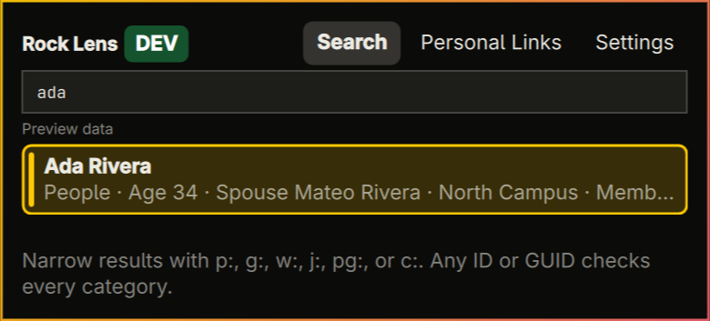
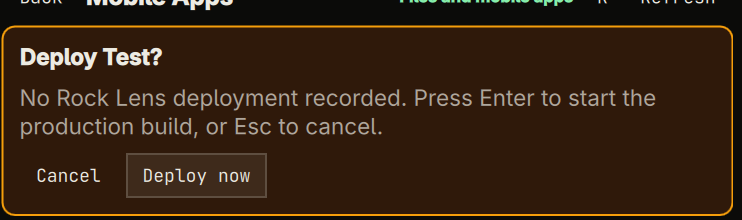

# Rock Arch — Bridging Rock RMS and Omarchy

Rock Arch is a keyboard-first Omarchy launcher for Rock RMS. Search People,
Groups, Workflow Types, Scheduled Jobs, Pages, and Content Channel Items; open
Rock Personal Links; and return to recently opened records without navigating
the full admin UI.

Every user signs directly into their own Rock instance. Rock Arch uses Rock's
native `.ROCK` session for Search, Personal Links, and optional Magnus features.
It does not require an OpenID client, Rock MCP, Magnus CLI, Node.js, or npm.



Accounts with Magnus access automatically receive the Magnus tab, including
folder browsing, bounded previews, downloads, clipboard actions, hashes, and
explicitly confirmed mobile-app builds.



## Install

Rock Arch supports Omarchy 4.0.2 or newer. Install the Git repository directly:

```bash
omarchy plugin add https://github.com/bscottdavis/rock-arch-omarchy.git --enable
```

Open it with `Super+R` or the Rock icon in the Omarchy bar. First launch asks
for only three values:

1. Your Rock domain, such as `rock.example.org`
2. Your Rock username
3. Your Rock password

Select **Connect**. The broker verifies the login before saving it to the
desktop password manager. No Rock administrator setup or client secret is
required.

Credentials cross the owner-only local socket only in an explicit login
request and are never returned. The launcher clears its password field
immediately; if the broker remains unavailable, any unsent credential request
is purged when the panel closes or the connection attempt times out.

## Updates

Git-managed installs check for updates once a day. Open **Settings** to see the
current version, check immediately, or install an available update. Automatic
installation is optional and off by default. Enable **Install updates
automatically** only if you want Rock Arch to apply a newly detected update
without another click.

Rock Arch delegates installation to Omarchy. Omarchy fetches the repository,
fast-forwards only, validates the updated plugin, rolls back a failed
validation, and reloads the shell. Local tracked changes or a diverged Git
history prevent automatic installation and leave the checkout untouched. The
equivalent terminal command is:

```bash
omarchy plugin update oneall.rock-arch
```

Third-party plugins are not updated by the general `omarchy update` command.
Update checks use the public Git remote and do not need GitHub credentials or a
token. Non-Git and development checkouts remain manually managed. Release notes
and publisher steps live in [CHANGELOG.md](CHANGELOG.md) and
[docs/RELEASING.md](docs/RELEASING.md).

The installed Omarchy integration uses `$XDG_RUNTIME_DIR/rock-arch/broker.sock`
and starts the broker without passing queries or credentials as arguments.

## Authentication and profiles

Rock Arch intentionally has one authentication system: Rock's native session
login. It posts the username and password to the selected instance's fixed
`/api/Auth/Login` endpoint over HTTPS, rejects redirects, validates the returned
`.ROCK` cookie, and keeps that cookie only in broker memory. The cookie expires
after 15 minutes without Rock Arch activity; the saved profile credentials let
the broker establish a new session when the user next performs an action.

Profile names, strict origins, the active profile ID, and preferences are
non-secret metadata stored owner-only in
`$XDG_CONFIG_HOME/rock-arch/profiles.json`. Usernames and passwords are stored
only by desktop Secret Service under a stable random profile ID. Two accounts
on the same Rock instance remain separate.

Use **Settings** (`Ctrl+,` or `Ctrl+4`) to add, rename, switch, test, sign out,
or remove profiles. **Sign out** clears that profile's username, password, and
memory-only cookie while retaining its local metadata and Recent Links.
**Remove** also deletes that profile's metadata and Recent Links. Both actions
require confirmation and never modify the Rock server.

The equivalent terminal commands are:

```bash
python3 -m rock_lens_broker rock login
python3 -m rock_lens_broker rock status
```

Rock Arch does not read legacy `oidc.json` metadata or use stored OAuth client
secrets/tokens. Version 0.14 removed that dormant experimental code; existing
user-owned legacy records are left untouched rather than silently deleted.

## Developer mode

Synthetic preview data remains available for UI development and privacy-safe
testing, but it is not exposed during normal use. The broker accepts DEV only
when its process starts with this exact flag:

```bash
ROCK_ARCH_DEVELOPER_MODE=1 python3 -m rock_lens_broker
```

The installed shell must receive the same environment flag before it starts.
When enabled, the DEV/PROD badge and switch reappear. Without the flag, startup
forces PROD, rewrites a previously saved DEV context to PROD, hides the switch,
and rejects direct socket requests to enter DEV. Values such as `true` or `yes`
do not enable it.

## Search, Personal Links, and Recent Links

In the launcher, an empty **Search** view shows local **Recent Links**, with a
confirmed **Clear** action in the section header and the first recent item
selected. Typing immediately replaces them with search results and selects the
first match. Unscoped searches include matching **Personal Links** by title or
section; an entity prefix keeps the search limited to that Rock category.
Personal Links are refreshed when the panel opens, then held briefly in memory
so searching them adds no request per keystroke. **Open** is offered for every
search category:
People, Groups, Workflow Types, Scheduled Jobs, Pages, and Content Channel
Items. Each target uses a fixed Rock route and must resolve to the exact
configured Rock origin; Personal Links have the same origin restriction.

All searches use fixed Rock REST v1 endpoints; Rock Arch does not use the v2
API or accept arbitrary endpoint paths. Start a query with an entity prefix to
search only that Rock category. A bare
prefix such as `g:` lists the first three items in that category.

| Category | Short prefix | Full aliases | Shortcut |
|---|---|---|---|
| People | `p:` | `person:`, `people:` | `Alt+P` |
| Groups | `g:` | `group:`, `groups:` | `Alt+G` |
| Workflow Types | `w:` or `wt:` | `workflow:`, `workflowtype:`, `workflowtypes:` | `Alt+W` |
| Jobs | `j:` | `job:`, `jobs:` | `Alt+J` |
| Pages | `pg:` | `page:`, `pages:` | `Alt+Shift+P` |
| Content Channel Items | `c:` | `content:`, `item:`, `items:` | `Alt+C` |

For example, `g: youth` calls only the Groups endpoint. Every scope also accepts
an exact Rock ID or GUID, such as `g: 42` or `p: a81b7c6d-1234-4abc-9876-0123456789ab`.
An ID or GUID entered without a prefix is checked across all enabled categories,
so a numeric ID can return several entity types when their IDs overlap. Add a
prefix when you know the entity type and want only that match. The active scope
appears as a badge beside the search field. `Esc` clears the scope before closing
the panel, and `Alt+0` clears it directly. Unknown prefixes remain ordinary
search text; no slash-command mode is required.

## Keyboard navigation

The search field keeps native editing behavior. Up and Down move through Recent
Links or results and across the Search/Personal Links boundary. Tab cycles the
search input, its displayed items, and Personal Links (Shift+Tab reverses), and
Enter or Space opens the selected live target. Backspace on a highlighted item
returns to the search field and deletes at the search cursor, so narrowing can
continue without an extra navigation step.

Every main view also has a direct keyboard route: `Ctrl+1` opens Search,
`Ctrl+2` opens Personal Links, `Ctrl+3` opens Magnus when the active profile has
access, and `Ctrl+4` opens Settings. In an empty Search, press `X` or `Delete`
to prepare clearing Recent Links, then `Enter` to confirm or `Esc` to cancel.
Magnus folders use Up/Down and Enter; `B` prepares a selected mobile-app build.
In a file preview, Tab walks the visible actions and the matching single-key
commands are shown on each button (`D`, `C`, `H`, `O`, and `R`). Build and clear
confirmations always move focus to an explicit action and remain escapable.

People results include compact duplicate-name context when Rock provides it:
age, conservatively identified spouse, family campus, and connection status.
Spouse is shown only for a married person with exactly one other active Adult
in the family group. Email, phone, address, and full birth date are not fetched.
Gated DEV never opens a target and does not display the PROD Recent Link
history.

## Optional Magnus features

After native login, Rock Arch independently probes the server-side Magnus API.
A successful probe enables the Magnus tab; a 403 or 404 hides it without
affecting Search, Personal Links, or Recent Links. Magnus folders use Up/Down
and Enter. File previews expose only descriptor-approved Download, Copy, Copy
hash, Open, and Refresh actions.

Only exact numeric mobile-app build paths advertised by Magnus become deploy
actions. Every build and repeat build requires a focused production
confirmation. Successful builds become profile-scoped **Magnus Build** Recent
Links. Write, upload, create, general delete, arbitrary HTTP, and arbitrary
build operations are not exposed. See [docs/MAGNUS.md](docs/MAGNUS.md) for the
full capability boundary.

## Safety guarantees

- Normal use is locked to PROD. DEV requires the exact process-level developer
  flag and remains visibly labeled while enabled.
- Native Rock login sends credentials only in a same-origin HTTPS request body,
  rejects redirects, validates the `.ROCK` cookie, and saves credentials only
  after a successful login.
- Sign-out and credential removal report failure unless Secret Service confirms
  deletion.
- Passwords and cookies never enter argv, repository files, logs,
  notifications, or screenshots.
- PROD never falls back to synthetic results. Without a configured Rock login
  the affected live category is empty; missing Magnus access affects only the
  Magnus tab.
- Live reads are fixed REST v1 GET operations with bounded responses and field-level
  output allowlists. QML cannot supply a URL, API path, OData field, or filter
  expression.
- Personal Links are read-only, restricted to same-origin HTTPS targets, and
  represented outside the broker by opaque IDs.
- Recent Links (the local Quick Return store) contain only launcher-opened
  targets and successfully triggered mobile app builds, are capped at 20, are
  visible only in PROD, and are stored under
  `$XDG_STATE_HOME/rock-arch` with owner-only permissions.
  Clearing them reports an error if the local history file cannot be removed.
- Magnus mobile-app rows show the time of the last successful deployment that
  Rock Arch initiated for the active profile. Magnus does not provide a global
  deployment timestamp, so builds started elsewhere are not represented.
- There is no general mutation transport, SQL execution, job trigger, or Run
  Now UI. The sole server-side action is an explicitly confirmed mobile app
  build advertised by the selected Magnus descriptor.
- Magnus accepts only the configured HTTPS Rock origin, rejects cross-origin
  and raw, percent-encoded, or multiply encoded traversal paths, uses the same
  authenticated Rock session, and does not expose write, upload, create, or
  delete operations.
- The broker refuses unsafe or non-socket objects at its runtime socket path;
  it reclaims only a private, owner-matching stale Unix socket. The plugin uses
  the absolute system Python path instead of resolving an executable from PATH.
- Broker errors are reduced to stable public codes. Response bodies,
  cookies, SQL, unselected PII, URLs, and exceptions are not logged or
  forwarded to QML.

See [docs/ARCHITECTURE.md](docs/ARCHITECTURE.md) and
[docs/VERIFICATION.md](docs/VERIFICATION.md).

## Development

Run the complete dependency-free test suite and a standalone broker with:

```bash
python3 -m unittest discover -s tests -v
python3 -m rock_lens_broker --socket /tmp/rock-arch-demo.sock
```

For a standalone installed command outside Omarchy, use `uv tool install .`.
Release notes and publisher checks are in [CHANGELOG.md](CHANGELOG.md) and
[docs/RELEASING.md](docs/RELEASING.md).
