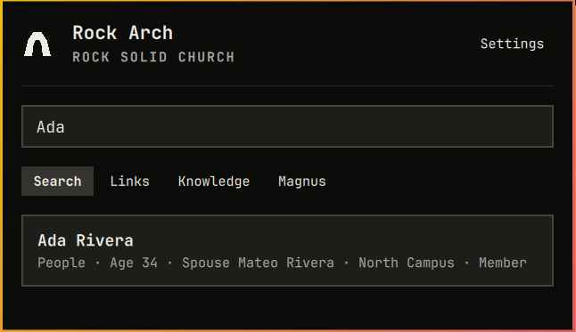
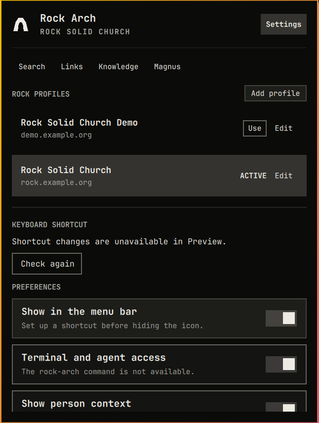

# Rock Arch design system

Rock Arch is an Omarchy panel first and a Rock RMS utility second. Its visual
language should therefore come from the active Omarchy theme and the shell's
first-party components, not from a parallel application theme.

## Reference surfaces

The primary references are the current Omarchy shell and the Basecamp-owned
plugins that ship the same kind of keyboard-first bar panel:

- [Omarchy shell architecture and theme tokens](https://github.com/omacom/omarchy/blob/quattro/docs/omarchy-shell.md)
- [Omarchy first-party plugins](https://github.com/omacom/omarchy/blob/quattro/shell/plugins/README.md)
- [Basecamp notifications for Omarchy](https://github.com/basecamp/omarchy-basecamp-plugin)
- [HEY for Omarchy](https://github.com/basecamp/omarchy-hey-plugin)

The supporting desktop guidance is intentionally narrow and authoritative:

- [GNOME typography](https://developer.gnome.org/hig/guidelines/typography.html)
- [GNOME writing style](https://developer.gnome.org/hig/guidelines/writing-style.html)
- [GNOME boxed lists](https://developer.gnome.org/hig/patterns/containers/boxed-lists.html)
- [GNOME placeholder pages](https://developer.gnome.org/hig/patterns/feedback/placeholders.html)
- [KDE layout and navigation](https://develop.kde.org/hig/layout_and_nav/)
- [KDE accessibility and inclusiveness](https://develop.kde.org/hig/accessibility/)
- [W3C focus appearance guidance](https://www.w3.org/WAI/WCAG22/Understanding/focus-appearance)

## Requirements

### Native theme behavior

- Use `Color`, `Style`, and `Border` roles from `qs.Commons` for every color,
  font size, corner, border, state, gap, and padding that has a shell token.
- Use controls from `qs.Ui` for buttons, text fields, toggles, separators,
  panel headers, focus surfaces, and panel geometry.
- Never assume a dark theme, a particular accent color, rounded corners, or a
  fixed 12 px base font. The active `shell.toml` remains authoritative.
- Reserve custom drawing for the Rock Arch brand mark. Functional icons use
  the same Nerd Font glyph language as the first-party panels.

### Panel anatomy

- Use the Basecamp and HEY plugin panel width of `Style.space(430)` and cap
  content height at `Style.space(600)`.
- Start with a compact hero: Rock Arch mark, product name, and the active
  profile or onboarding purpose.
- Separate the hero from navigation and content with `PanelSeparator`.
- Keep primary navigation on one quiet row. The active destination uses the
  shell's selected state; pointer hover and keyboard focus use the shell's
  hover/focus state.
- Keep tab order user-editable. Numbered shortcuts follow the visible order;
  Settings stays in the header on `Ctrl+,`. Alt shortcuts filter Rock entity
  categories. Knowledge has a numbered tab shortcut and no Alt alias.
- Put persistent status in the relevant section. Keep the panel footer for
  transient progress, success, and error messages only; hide it when empty.

### Hierarchy and density

- Use only the shell type scale: title for the product, heading for a single
  major task title, body for primary row text, caption/body-small for metadata,
  and `PanelSectionHeader` for section labels.
- Use no more than two weights in one row. Primary text may be semibold; metadata
  is regular and dimmed with the first-party `Qt.darker` treatment.
- Use `Style.spacing.panelGap` between major regions, `rowGap` between rows,
  and `rowPaddingX` inside interactive rows.
- Group related controls closely and separate different groups with space or a
  separator. Do not use decorative cards around every section.

### Lists and selection

- Every searchable, recent, personal-link, Magnus, and profile row shares the
  same `CursorSurface`-equivalent selection treatment.
- The selected row must be visible without changing its text metrics or causing
  reflow. Text always keeps at least `Style.spacing.rowPaddingX` of inset.
- Rows use a title plus one compact metadata line. A third line appears only
  when it materially distinguishes the item, such as person context or the last
  Magnus deployment.
- Long titles and identifiers elide; explanatory text wraps only in detail,
  confirmation, or empty-state regions.

### Controls and settings

- Use quiet, borderless actions for low-risk row commands and bordered controls
  for primary or confirmable actions.
- Preferences are full-width toggle rows with a short title and an optional
  description that adds useful information. Category choices use an evenly
  sized grid of compact selected buttons.
- Destructive actions use `Color.urgent`, require an explicit second action,
  and always support Escape to cancel.
- Profile rows show identity, active state, and the direct Use action first.
  Edit reveals management actions and connection capabilities.

### Keyboard and accessibility

- Opening a destination focuses the control or first item most likely to be
  used next.
- Tab, Shift+Tab, arrows, Enter, Space, Backspace, and Escape retain their
  existing behavior across all views.
- Keyboard focus and list selection use the shell's visible focus/cursor tokens;
  focus must never be indicated by color alone or hidden behind clipped content.
- No essential action is available only through hover or a tooltip. Shortcut
  hints may supplement, but never replace, a visible label.

### Copy and states

- Labels use Rock users' vocabulary and say what an action does: `Search`,
  `Open`, `Deploy`, `Sign out`, and `Update`.
- Keep explanatory copy short. Avoid implementation terms such as broker,
  socket, endpoint, descriptor, or synthetic data in normal user-facing UI.
- Loading, empty, signed-out, unavailable, confirmation, success, and error
  states each provide one clear next action when an action is possible.
- Never surface domains, credentials, file contents, or identifiers where they
  are not needed for the current task.

## Panel-specific decisions

- **Onboarding:** one focused connection task with four labeled fields and one
  primary Connect action, followed by one Finish setup screen for search
  categories and the optional automatic-update choice when the install supports
  it. The primary action continues to Search; no application navigation
  competes with the active onboarding step.
- **Search:** search input first, then either Recent Links or Rock results. It
  contains no public-KB control or tutorial copy. Person context stays attached
  to the person result instead of becoming a competing card.
  Static, clickable category hints appear beneath the empty input. More reveals
  remaining enabled and accessible categories; typing hides the hints. They
  participate in keyboard focus and use the same scope logic as typed prefixes.
- **Knowledge:** a dedicated top-level workspace whose empty state teaches the
  supported area prefixes without crowding Search. Results reuse the standard
  selected-row treatment;
  Enter opens a plain-text detail with trust/version context, Back, and Open
  source. Typed related items continue within the panel, and Back unwinds that
  detail history before returning to results.
- **Personal Links:** a single bookmark list with section metadata; no repeated
  keyboard tutorial below the list.
- **Magnus:** breadcrumb/task title plus Refresh, a shared list treatment, and a
  bounded preview. Deploy remains the only server-side action and keeps a
  dedicated production confirmation.
- **Settings:** profiles, preferences, categories, and updates are four visibly
  separate groups. Editing the active profile reveals Magnus availability, so there is
  no redundant Connection section. Terminal and agent access is a default-on
  preference here, not another onboarding choice; its copy names `rock-arch`
  and shows installation errors when relevant. Transport details belong in the
  CLI documentation.

## September 2026 research and review

Research and implementation review, 5 September 2026. The runtime reference
is the installed Omarchy 4.0.2 shell. This is Rock Arch's interpretation of
the sources below, not an official Omarchy certification or a claim that DHH
personally designed every component.

### Sources and practical rules

| Source | Finding | Application to Rock Arch |
| --- | --- | --- |
| [Omarchy plugin development guide](https://plugins.omarchy.org/develop.html) | Begin with a built-in plugin matching the interaction; use the shared shell and its components. | Keep `Panel`, `KeyboardPanel`, the native hero, controls, separators, and IPC lifecycle. |
| [Shipped style tokens](https://github.com/omacom/omarchy/blob/quattro/shell/Commons/Style.qml) and [UI components](https://github.com/omacom/omarchy/tree/quattro/shell/Ui) | Typography, spacing, border states, and corner shape respond to the user's theme and display settings. | Use `Style`, `Color`, and `Border`; keep the Rock Arch mark theme-colored. Do not impose a separate palette or corner style. |
| [Built-in panels](https://github.com/omacom/omarchy/tree/quattro/shell/plugins/panels) | Audio, Clock, and Tailscale organize a compact hero, small section labels, direct controls, and clear current/cursor states. | Keep the existing hero; use its trailing-control slot for Settings, and reserve the tab row for work areas. Use flat profile rows with the native selected fill. |
| [Basecamp plugin](https://github.com/basecamp/omarchy-basecamp-plugin/blob/master/Panel.qml) and [HEY plugin](https://github.com/basecamp/omarchy-hey-plugin/blob/master/Panel.qml) | Both use scaled 430-wide panels capped at 600, compact headers, quiet controls, and an inner scrolling list. HEY puts Settings at the header's trailing edge. | Keep Rock Arch's dimensions; use native layout sizing to give the list the remaining space. Place a labeled Settings control in the hero. |
| [DHH's Quattro proposal](https://github.com/omacom/omarchy/pull/6231) | Related launcher and menu actions share one searchable surface; theming and text sizing apply across the shell. | Keep immediate search focus, existing keyboard routes, and a single panel. Fit the scrollable content after accounting for fixed controls. |
| [DHH: Omarchy is out](https://world.hey.com/dhh/omarchy-is-out-4666dd31) | Omarchy offers an opinionated, ready-to-use developer environment that users can make their own. | Provide useful defaults and optional shortcuts; keep existing user bindings and preferences. |
| [DHH: Beautiful motivations](https://world.hey.com/dhh/beautiful-motivations-6fef7c73) | Aesthetic care contributes to the quality and pleasure of using tools; it is an accumulation of small decisions. | Refine hierarchy, language, and spacing in the working interface. Preserve function and recognizable identity. |
| [Basecamp: Epicenter Design](https://basecamp.com/gettingreal/09.2-epicenter-design) and [Build Less](https://basecamp.com/gettingreal/02.1-build-less) | Start with the essential task and limit incidental choices. These are broader product principles, not shell specifications. | Put the search field before secondary navigation. Keep profile switching immediate; reveal maintenance actions through Edit. |
| [GNOME writing guidance](https://developer.gnome.org/hig/guidelines/writing-style.html), [KDE accessibility](https://develop.kde.org/hig/accessibility/), and [W3C focus appearance](https://www.w3.org/WAI/WCAG22/Understanding/focus-appearance) | Use familiar, concise language without losing meaning; test keyboard navigation and visible focus. | Shorten routine descriptions, retain actionable errors and confirmation text, and exercise the controls using only the keyboard. These support interaction review, not adoption of another desktop's appearance. |

The official references inspected do not present a separate comprehensive
plugin visual-standard document. The installed component implementation and
built-in plugins provide the strongest practical reference. A community
style guide is not treated as an official requirement.

### Audit and changes

The native Search and Settings screens and the built-in Audio panel were
captured and inspected before implementation. Captures containing account
information are private local review artifacts, not repository assets.

1. **Search:** The main field followed a navigation row, and an empty status
   footer still consumed space. Search now appears before the work-area tabs;
   its input has an accessible name. The status area occupies space only while
   it has something to report. Search matching, selection, and open behavior
   retain their existing contracts.
2. **Settings:** Every profile exposed maintenance actions continuously.
   Profile rows now emphasize account identity, the active account, and Use.
   Edit reveals rename, login, connection testing, sign-out, and removal;
   those actions wrap when space is limited. Confirmation remains required
   for sign-out and removal. Routine successful status uses quiet text.
3. **Preferences and setup:** Several descriptions repeated their labels or
   explained implementation details during normal use. Descriptions now focus
   on consequences and actionable errors. Finish Setup uses the same native
   toggle as Settings for automatic updates. Shortcut setup remains optional.
4. **Panel sizing:** The shell could cap the outer panel while its inner list
   retained a fixed height. The list now uses the space remaining after the
   header, navigation, search, and feedback, keeping its end reachable. Setup
   grows to its natural height within the shell's cap, and keyboard focus
   reveals the Continue action if the content must scroll.

### Native review evidence

These screenshots show the installed QML components with an isolated broker
using synthetic accounts and injected test adapters. The preview forbids
credential-store access and network connections.

The native keyboard walkthrough covered search entry, opening Settings, profile
editing, sign-out confirmation cancellation, reaching the last Settings
controls, and completing setup with Enter. Closing a profile editor now also
clears its pending confirmation message. Completing setup saved the fixture's
choices and returned focus to Search.

Verification passed: 222 Python tests, 35 Qt behavioral tests (43 including
suite setup and cleanup), Ruff, and Omarchy plugin validation. Follow-up native
checks exercised More, selecting Pages by keyboard, CLI-driven tab reordering,
Ctrl+1 opening the newly first tab, and keyboard reordering from Settings.

### Review boundaries

Live checks cover the installed shell and the exercised keyboard paths.
Preview data is used for public screenshots and operations that should not
touch a real account. Automated broker and Qt behavioral tests retain the
existing credential, search, reconnect, and shortcut safeguards.

Native control reuse and an accessible input name are useful foundations;
they do not establish full screen-reader accessibility, larger-font coverage,
or contrast compliance for every user-supplied theme. Avoid claiming these
without direct testing.
