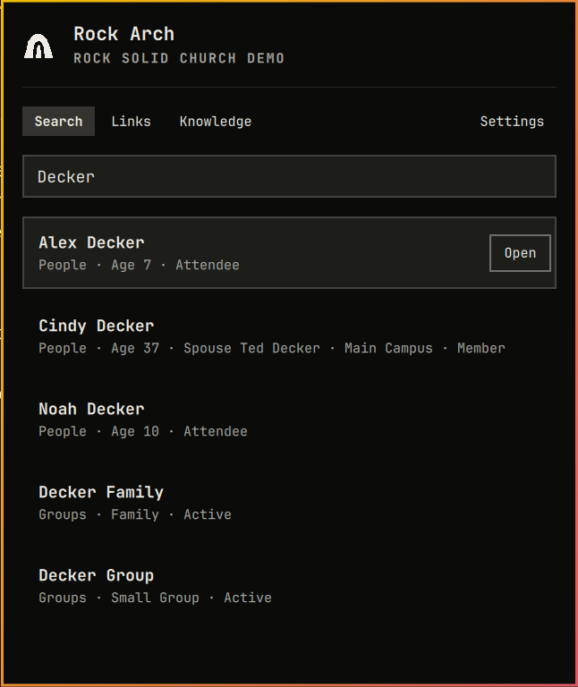
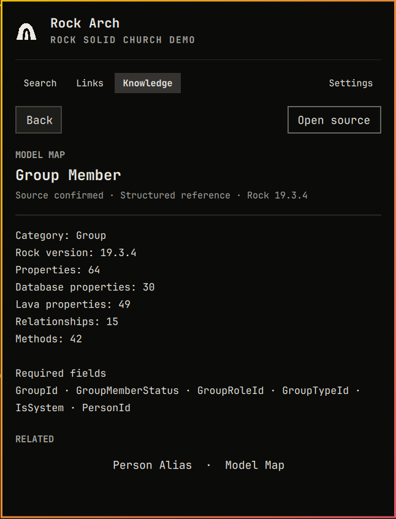
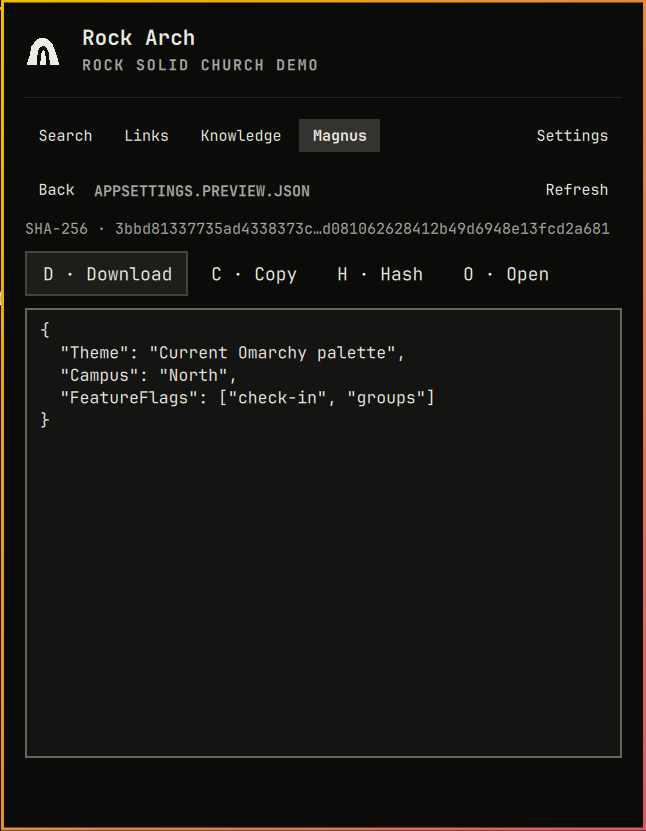

# Keyboard and panel audit

Audited 2026-09-02 against the installed Omarchy shell. The review covered
every Rock Arch surface: login and Finish setup onboarding, header navigation,
Search and Recent Links, Personal Links, Magnus browsing and file actions,
build confirmation, Settings, and the dedicated public Knowledge workspace.

## Outcome

The primary workflows are keyboard-complete and use a consistent focus model.
List views keep the shared selected-row treatment; form and action views use
the shell's native focused-button treatment. Moving between views resets stale
scroll position, so the selected first item is not clipped. Magnus is shown in
normal use only when the active Rock profile reports access. The gated preview
workspace also supplies a complete, side-effect-free Magnus experience for UI
development and documentation.

## Audit steps and health

1. **Onboarding — healthy.** Profile name, domain, username, password, and Connect form a
   closed Tab/Shift+Tab loop. Enter advances fields or submits from the
   password field. After login, Finish setup checks all eight supported entity
   categories, offers only those the account can search, and includes automatic
   updates in one keyboard-complete screen. Navigation remains hidden until
   setup succeeds; a failed access check leaves a focused retry action.
2. **Header — healthy.** Tab/Shift+Tab continue to cycle the launcher views.
   `Ctrl+1` through `Ctrl+4` follow the editable visible tab order; Settings
   stays on `Ctrl+,`. These shortcuts use application
   scope because the bar widget and its keyboard panel are separate windows.
3. **Search and Recent Links — healthy.** The first recent or result is selected
   immediately, Up/Down moves the selection, Enter opens it, and Backspace
   returns to the search field while deleting at the cursor. `X` or `Delete`
   opens a focused, escapable clear confirmation. Empty-state guidance now
   reflects the actual view.
4. **Rock Knowledge — healthy.** The dedicated Knowledge tab and `Ctrl+3` (default order) open
   the public workspace; typing `kb:` in Search transfers there without adding
   controls to the Search UI. Up/Down selects results, Enter opens the selected
   detail, Tab moves through Back, Open source, and related items, and Esc walks
   the nested detail history. The empty state teaches `mm:`, `is:`, `idea:`,
   `lava:`, `recipe:`, and `guide:` search areas.
5. **Personal Links — healthy.** The first item is selected on entry, Up/Down
   moves, Enter opens, and the view resets and reveals its selection instead of
   inheriting a stale scroll offset from another panel.
6. **Magnus browser — healthy.** The first item is selected, Up/Down and Enter
   browse, Backspace or Esc returns, `R` refreshes, and `B` opens the selected
   mobile-app build confirmation. Preview context follows the actual hierarchy
   from content-family folders to the Mobile Applications listing and then into
   application, page, block, and file descendants. It shows Deploy only on the
   application row and suppresses every side effect.
7. **Magnus file preview — healthy with a bounded preview check.** The
   Download action receives focus when a preview opens. Tab walks every visible
   action; `D`, `C`, `H`, `O`, and `R` remain direct shortcuts. Code structure,
   lint parsing, navigation tests, and the retained deterministic file capture
   cover the preview without reading or retaining private file content.
8. **Build confirmation — healthy.** Deploy now receives focus on entry, Tab
   moves to Cancel, Enter activates the focused action, and Esc cancels. No
   production build was started during this audit.
9. **Settings — healthy.** Tab/Shift+Tab walk profile controls, inline profile
   renaming, login fields, preferences, categories, update actions, and toggles;
   focused controls are scrolled into view. Unavailable entity categories are
   omitted and a failed access check exposes a keyboard-focusable retry action.

## Privacy-safe visual evidence

The retained captures are cropped to Rock Arch and contain no credentials,
production tenant, raw Rock identifiers, Personal Link targets, or private
Magnus file contents. Search uses the intentionally public Demo Church;
Knowledge uses the fixed public service; Personal Links, Recent Links, and
Magnus use deterministic preview fixtures.

## Keyboard map

| Surface | Move | Activate | Return or cancel | Direct actions |
|---|---|---|---|---|
| Views | Tab / Shift+Tab | — | Esc | Ctrl+1 Search, Ctrl+2 Personal, Ctrl+3 Knowledge, Ctrl+4 Magnus, Ctrl+, Settings |
| Search / Recent | Up / Down (stays in list) | Enter or Space | Backspace edits search | X or Delete clears Recent Links |
| Knowledge results | Up / Down | Enter opens detail | Backspace edits search | `Ctrl+3` (default order) opens Knowledge |
| Knowledge detail | Tab / Shift+Tab | Enter or Space follows actions and related items | Esc walks Back history | Open source |
| Personal Links | Up / Down | Enter or Space | Backspace returns to Search | — |
| Magnus folders | Up / Down | Enter or Space | Backspace or Esc | R refresh, B deploy selected app |
| Magnus preview | Tab / Shift+Tab | Enter or Space | Esc | D download, C copy, H hash, O open, R refresh |
| Confirmations | Tab / Shift+Tab | Enter or Space | Esc | — |
| Onboarding / Settings | Tab / Shift+Tab | Enter or Space | Esc | — |
