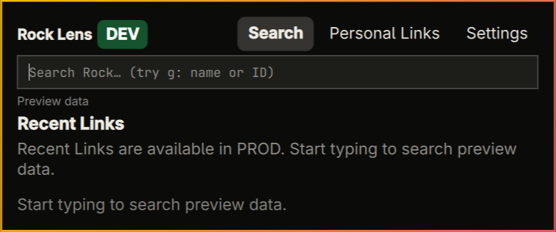
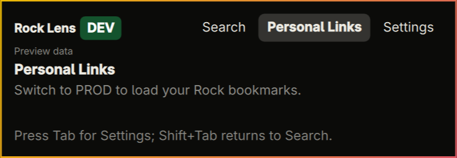

# Keyboard and panel audit

Audited 2026-09-02 against the installed Omarchy shell. The review covered
every Rock Lens surface: onboarding, header navigation, Search and Recent
Links, Personal Links, Magnus browsing and file actions, build confirmation,
and Settings.

## Outcome

The primary workflows are keyboard-complete and use a consistent focus model.
List views keep the shared selected-row treatment; form and action views use
the shell's native focused-button treatment. Moving between views resets stale
scroll position, so the selected first item is not clipped. Magnus is shown
only in PROD and only when the active Rock profile reports access.

## Audit steps and health

1. **Onboarding — healthy.** Domain, username, password, and Connect form a
   closed Tab/Shift+Tab loop. Enter advances fields or submits from the
   password field. Navigation remains hidden until login succeeds.
2. **Header — healthy.** Tab/Shift+Tab continue to cycle the launcher views.
   `Ctrl+1` through `Ctrl+4` provide deterministic access to Search, Personal
   Links, Magnus when available, and Settings. These shortcuts use application
   scope because the bar widget and its keyboard panel are separate windows.
3. **Search and Recent Links — healthy.** The first recent or result is selected
   immediately, Up/Down moves the selection, Enter opens it, and Backspace
   returns to the search field while deleting at the cursor. `X` or `Delete`
   opens a focused, escapable clear confirmation. Empty-state guidance now
   reflects the actual view.
4. **Personal Links — healthy.** The first item is selected on entry, Up/Down
   moves, Enter opens, and the view resets and reveals its selection instead of
   inheriting a stale scroll offset from another panel.
5. **Magnus browser — healthy.** The first item is selected, Up/Down and Enter
   browse, Backspace or Esc returns, `R` refreshes, and `B` opens the selected
   mobile-app build confirmation. DEV no longer exposes an unusable Magnus tab.
6. **Magnus file preview — healthy with a privacy-bounded live check.** The
   Download action receives focus when a preview opens. Tab walks every visible
   action; `D`, `C`, `H`, `O`, and `R` remain direct shortcuts. Code structure,
   lint parsing, and navigation tests cover the preview without retaining a
   screenshot of private file content.
7. **Build confirmation — healthy.** Deploy now receives focus on entry, Tab
   moves to Cancel, Enter activates the focused action, and Esc cancels. No
   production build was started during this audit.
8. **Settings — healthy.** Tab/Shift+Tab walk profile controls, login fields,
   preferences, and categories; focused controls are scrolled into view.

## Privacy-safe visual evidence

The retained captures are cropped to Rock Lens and use synthetic content where
possible. No credentials, tenant domain, raw Rock identifiers, Personal Link
targets, or Magnus file contents are present.

## Keyboard map

| Surface | Move | Activate | Return or cancel | Direct actions |
|---|---|---|---|---|
| Views | Tab / Shift+Tab | — | Esc | Ctrl+1 Search, Ctrl+2 Personal, Ctrl+3 Magnus, Ctrl+4 Settings |
| Search / Recent | Up / Down | Enter or Space | Backspace edits search | X or Delete clears Recent Links |
| Personal Links | Up / Down | Enter or Space | Backspace returns to Search | — |
| Magnus folders | Up / Down | Enter or Space | Backspace or Esc | R refresh, B deploy selected app |
| Magnus preview | Tab / Shift+Tab | Enter or Space | Esc | D download, C copy, H hash, O open, R refresh |
| Confirmations | Tab / Shift+Tab | Enter or Space | Esc | — |
| Onboarding / Settings | Tab / Shift+Tab | Enter or Space | Esc | — |
